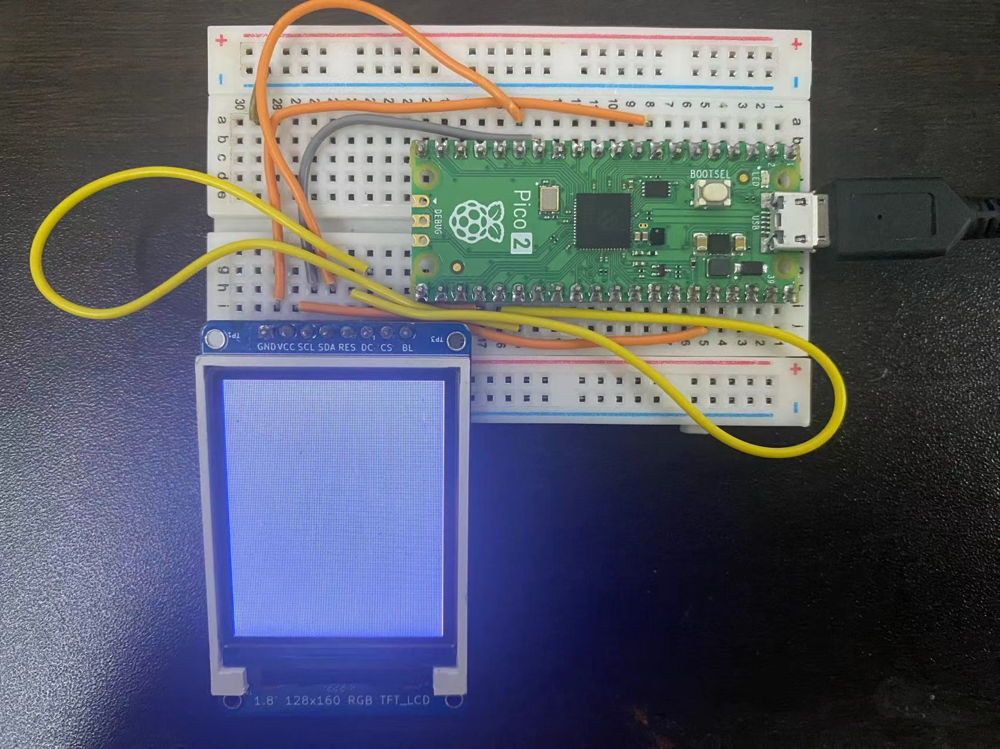
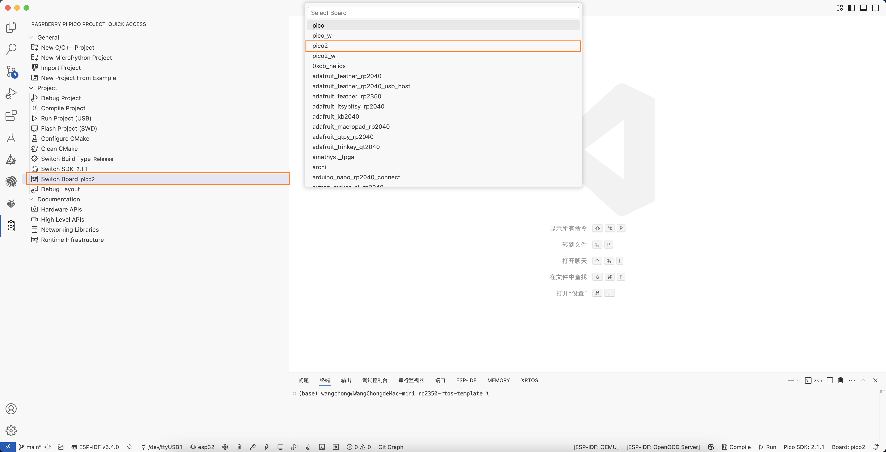
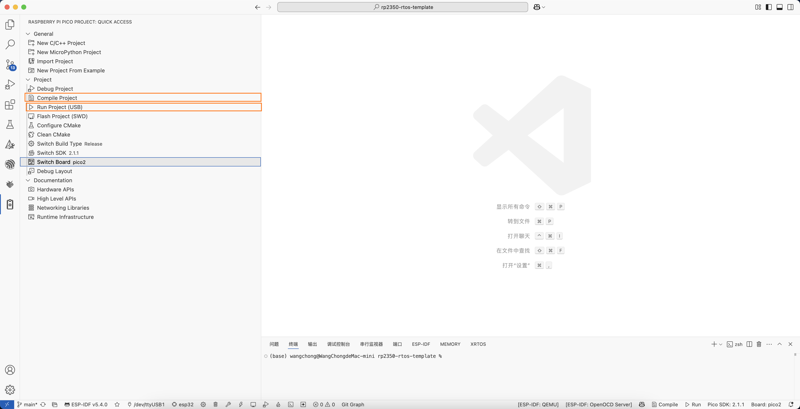

# 简介
* 本项目支持是对RP2350 FreeRtos的移植. 支持内核的切换(有限制)

### 功能列表核心支持
1. ARM核心
2. RISC-V核心

### 使用说明
1. Clone当前的仓库到你本地
```
git clone https://github.com/mz1874/rp2350-rtos-template.git
```

2. 初始化子模块
```
cd rp2350-rtos-template
git submodule update --init --recursive
```

3. 打开项目
```
code .
```

4. 使用PICO拓展插件切换芯片的架构

5. 在Cmakelist里切换当前移植文件, 如下所示, 打开对应的注释即可使用对应的移植环境
```

# 使用RP2040的移植
include(${FREERTOS_KERNEL_PATH}/portable/ThirdParty/GCC/RP2040/FreeRTOS_Kernel_import.cmake)

#使用RP2350基于ARM的移植
include(${FREERTOS_KERNEL_PATH}/portable/ThirdParty/Community-Supported-Ports/GCC/RP2350_ARM_NTZ/FreeRTOS_Kernel_import.cmake)

#使用RP2350基于RISC-V的移植
include(${FREERTOS_KERNEL_PATH}/portable/ThirdParty/Community-Supported-Ports/GCC/RP2350_RISC-V/FreeRTOS_Kernel_import.cmake)


```
6. 编译和烧录



**<span style="color:red">已知的问题</span>**
- 在使用RISC-V核心的时候FreeRTOSConfig.h配置文件中, 如果配置的为单核心,那么将会不可用, 必须配置为双核心,并且将configUSE_CORE_AFFINITY 配置为1, 如果使用ARM核心将不会有这个问题.
```
#define configNUMBER_OF_CORES 1
#define configTICK_CORE 0
#define configRUN_MULTIPLE_PRIORITIES 0
#define configUSE_CORE_AFFINITY 0  
```

**下面的为正确的配置**
```
#define configNUMBER_OF_CORES 2
#define configTICK_CORE 0
#define configRUN_MULTIPLE_PRIORITIES 0
#define configUSE_CORE_AFFINITY 1 
```