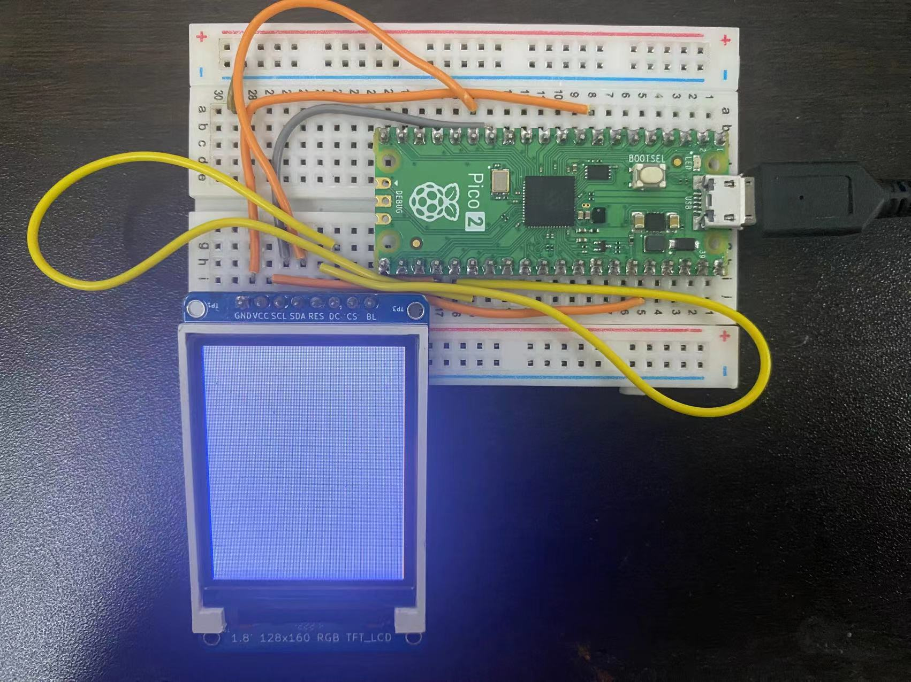
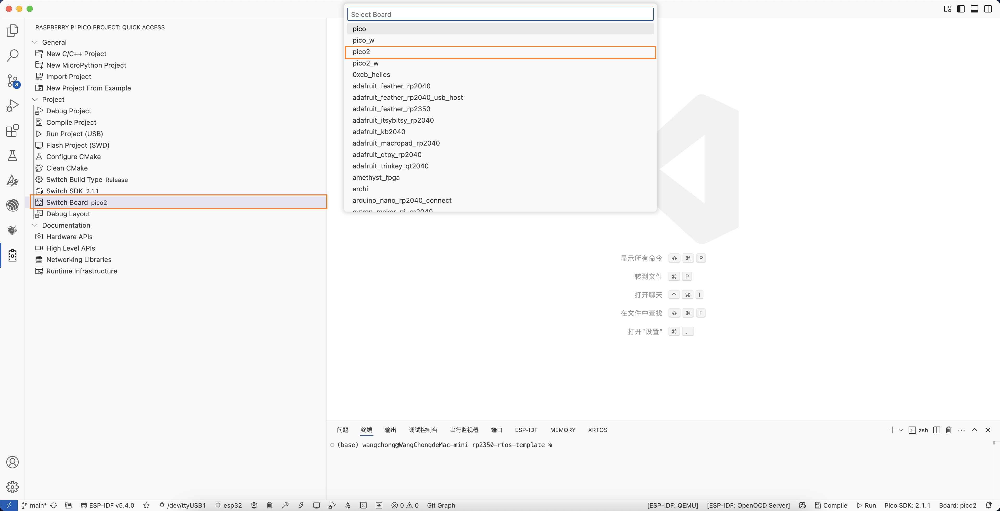
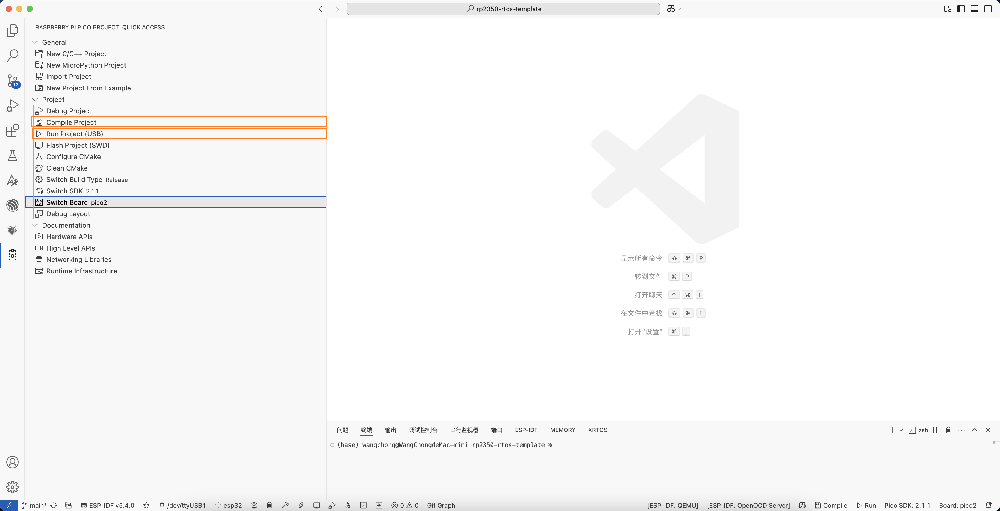

# Introduction

* This project supports the porting of FreeRTOS for RP2350. It supports kernel switching (with limitations), and the reference project is from https://github.com/LearnEmbeddedSystems/rp2040-freertos-template.git.

### Core Features
1. ARM CORE
2. RISC-V CORE

### Usage Instructions
1. Clone the current repository to your local machine
```
git clone https://github.com/mz1874/rp2350-rtos-template.git
```

2. Initialize the submodules
```
cd rp2350-rtos-template
git submodule update --init --recursive
```

3. Open the project
```
code .
```

4. Use the PICO extension plugin to switch the chip architecture


You can choose to enable RISC-V or ARM

5. In the CMakeLists file, switch the current porting file according to the architecture you selected (you can also choose RP2040's). As shown below, uncomment the corresponding lines to use the corresponding porting environment.
```

# Use RP2040 porting
include(${FREERTOS_KERNEL_PATH}/portable/ThirdParty/GCC/RP2040/FreeRTOS_Kernel_import.cmake)

#Use RP2350 ARM-based porting
include(${FREERTOS_KERNEL_PATH}/portable/ThirdParty/Community-Supported-Ports/GCC/RP2350_ARM_NTZ/FreeRTOS_Kernel_import.cmake)

#Use RP2350 RISC-V-based porting
include(${FREERTOS_KERNEL_PATH}/portable/ThirdParty/Community-Supported-Ports/GCC/RP2350_RISC-V/FreeRTOS_Kernel_import.cmake)


```
6. Compile and flash



**<span style="color:red">Known Issues</span>**
- When using the RISC-V core, in the FreeRTOSConfig.h configuration file, if configured as a single core, it will not be usable. It must be configured as dual-core, and configUSE_CORE_AFFINITY must be set to 1. If using the ARM core, this issue will not occur.

```
#define configNUMBER_OF_CORES 1
#define configTICK_CORE 0
#define configRUN_MULTIPLE_PRIORITIES 0
#define configUSE_CORE_AFFINITY 0  
```

**The following is the correct configuration**
```
#define configNUMBER_OF_CORES 2
#define configTICK_CORE 0
#define configRUN_MULTIPLE_PRIORITIES 0
#define configUSE_CORE_AFFINITY 1 
```


## Trouble shooting 

- Issue: Frequent architecture switching causes PICO plugin errors, making the project unable to compile.

**Solution**: Delete the build folder, then recreate the build folder, enter the build directory and execute `cmake ..`, then Clean Cmake. Recompile afterwards.


# Don't be stingy with your Star!!!